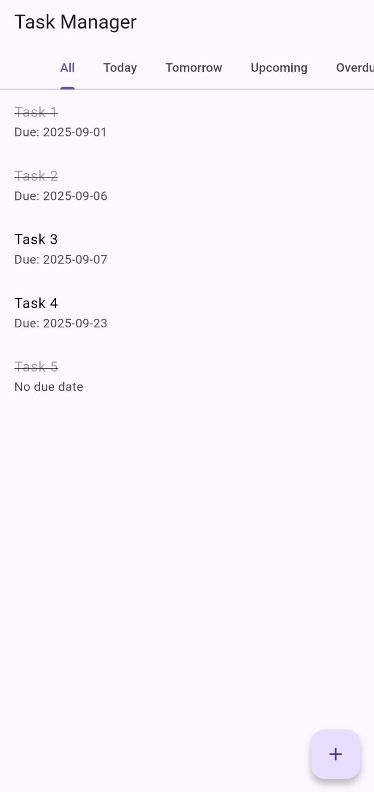
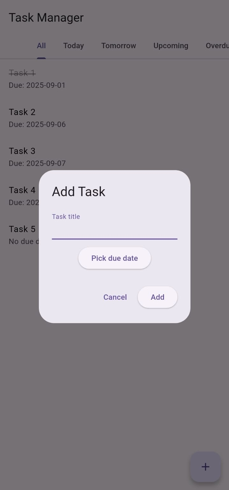
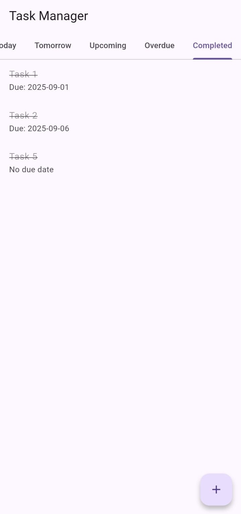

# Plan It App


**Plan It** is a Flutter-based productivity app to schedule tasks, manage routines, and track progress effectively.

## Features
- Add, view, and delete tasks
- Schedule tasks by date and time
- Track completed tasks
- Clean and minimal UI
- Lightweight and fast

## Screenshots




## Tech Stack
- **Frontend:** Flutter, Dart
- **Backend:** Firebase (optional)
- **State Management:** Provider / setState
- **Version Control:** Git & GitHub

## Installation
```bash
git clone https://github.com/SDK2908/Plan_It_App.git
cd Plan_It_App
flutter pub get
flutter run
